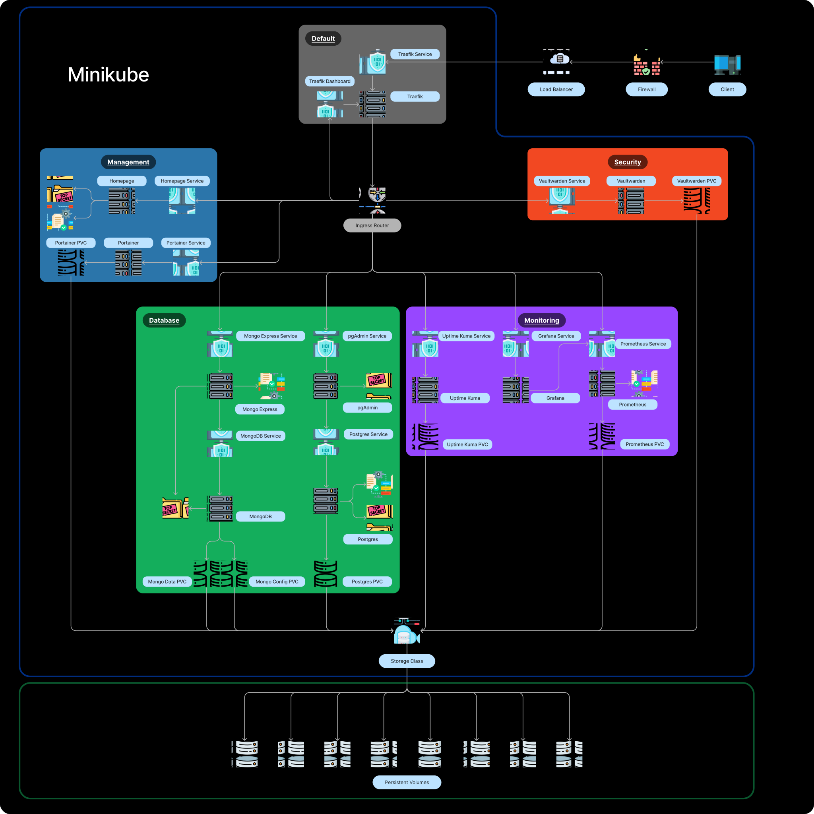

# Kubernetes Showcase using Minikube

## Overview

This repository is a comprehensive showcase of Kubernetes features using Minikube. It provides setup scripts for a smooth installation process and templates that can be used to explore different aspects of Kubernetes.

## What's Inside?

Inside this repository, you will find scripts that automate the installation of the following tools:

- Docker: Industry-standard containerization platform.
- Minikube: Tool to run Kubernetes locally on your machine.
- Kubernetes: Powerful container orchestration system.
- Helm: Package manager for Kubernetes that streamlines application deployment.

These resources cater to both beginners learning about Kubernetes and experts looking for a reference implementation. Follow the setup scripts to install dependencies, or jump straight to the templates if you already have a cluster up and running.
Feel free to modify these templates according to your needs.

## Architecture Diagram

Here's a diagram showing the organization and connectivity between components in the cluster:



## Getting Started

1. If you don't have any prerequisites installed, start by executing the setup scripts. They will walk you through the installation process.

1. After setting everything up, deploy the templates onto your functional cluster and familiarize yourself with Kubernetes features.

1. Templates are flexible—customize them to fit your individual requirements (e.g., modifying the `main-storage` StorageClass or tailoring Persistent Volumes to suit your cluster configuration).

1. After deploying [**HomePage**](http://localhost/) and [**Traefik**](http://proxy.localhost/), connect to your application via `localhost`.

   > Note: You may need to start the Minikube tunnel to enable LoadBalancer access.

For a quick and minimal setup, run:

```bash
bash run.sh -cimz
```

To launch all features at once, use:

```bash
bash run.sh -caz
```

## Additional Information

Run the following command to see a list of available options and usage instructions:

```bash
bash run.sh -h
```

This command displays a helpful summary of the project's functionality and guides you on using the scripts and templates efficiently.
